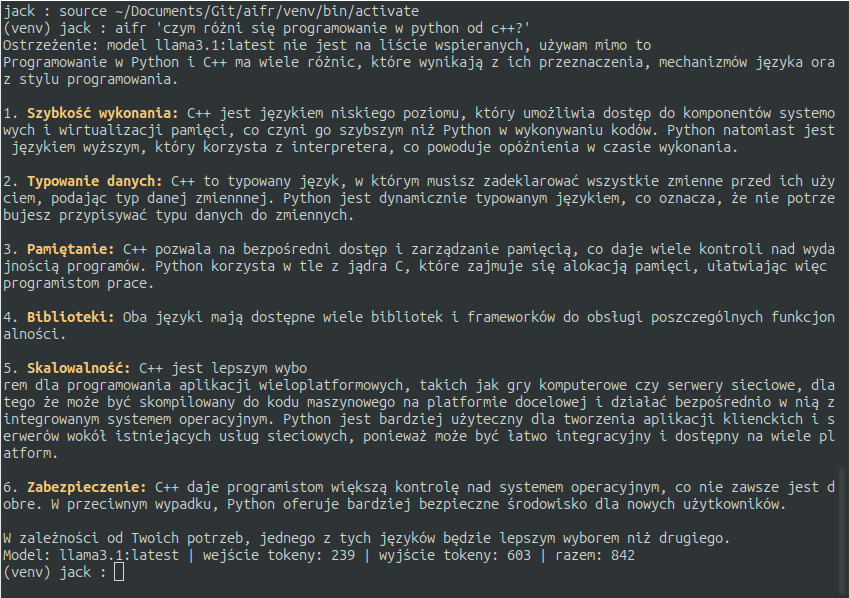
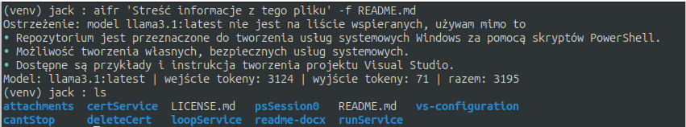

# Aifr Terminal Assistant

**Wersja 1.2.0 - Multi-Provider** 🌐

Profesjonalny asystent terminalowy w Pythonie z wsparciem dla wielu dostawców API (Sherlock, OpenAI, OpenWebUI, Brave) i inteligentną selekcją agentów.

[](https://www.python.org/downloads/)
[](https://opensource.org/licenses/MIT)

---

Czytaj więcej na [pages](https://isjackalive.github.io/aifr/).

<div align="center">

> **🌟 NEW in v1.3.0: Smart Agents & Clean Pipes!**  
> Aifr now supports custom agents via config, multi-file context, and smart TTY detection for clean pipe output.  
> See [CHANGELOG.md](CHANGELOG.md) for details.

[](CHANGELOG.md)


</div>


## ✨ Features

- 🌐 **Multi-provider** - Sherlock, OpenAI, OpenWebUI, Brave API support
- 🤖 **Agentic behavior** - Built-in agents + **Custom Agents** support
- 🪟 **Sliding window context** - Inteligentne zarządzanie historią (5 ostatnich tur)
- 🔒 **Production-grade** - Pełne type hints, 71 testów jednostkowych, mypy validation
- 🛡️ **Security** - Automatyczna detekcja wrażliwych plików (.env, klucze SSH)
- 🔄 **Pipe-friendly** - **Smart TTY** detection for clean output in pipelines
- 📦 **Easy install** - Dostępne przez `pip install aifr`
- 🎯 **Smart model selection** - Automatyczny wybór lub **Dynamic Aliases**
- 💬 **Context memory** - Zapamiętywanie historii konwersacji między wywołaniami
- 📊 **Stats flag** - Podgląd metadanych (agent, tokeny, model)

## 📦 Instalacja

```bash
git clone https://github.com/IsJackAlive/aifr.git

cd aifr

python3 -m venv .

source ./venv/bin/activate

pip install -e .
```

### Przykłady użycia:




